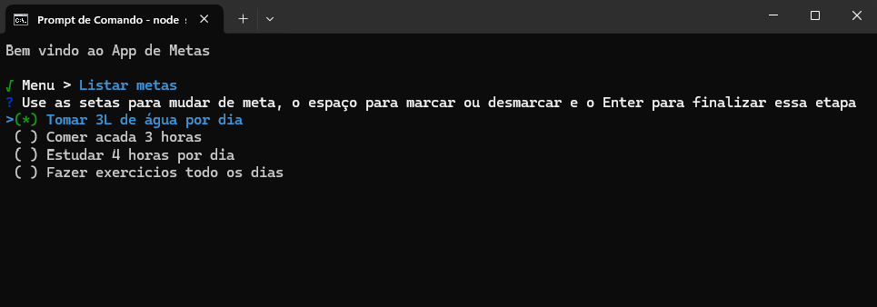

<p align="center">
  
</p>

<p align="center">
  Aplicação desenvolvida no NLW Pocket Javascript da Rocketseat na trilha Iniciante. 
</p>

<p align="center">
  <a href="#-tecnologias">Tecnologias</a>&nbsp;&nbsp;&nbsp;|&nbsp;&nbsp;&nbsp;
  <a href="#-projeto">Projeto</a>&nbsp;&nbsp;&nbsp;|&nbsp;&nbsp;&nbsp;
  <a href="#-layout">Layout</a>
</p>

<br>

<p align="center">
  
</p>

## 🛠️ Tecnologias

Esse projeto foi desenvolvido com as seguintes tecnologias:

- Javascript
- Nodejs

## 🚀 Projeto

Nesse projeto iremos criar um aplicativo de controle de metas, projeto usado via terminal Sistema de cadastro de metas criado com somente Javascript. Feito para fins de estudo da linguagem durante o evento NLW Pocket da RocketSeat. 

### ▶️ Rodando projeto: no terminal CMD ou VSCode 
```sh
  cd c:/caminho/do/projeto
  node script.js
```

## Linguagem de programação

Maneira de dar instrução ao computador.
Como um lego, você irá utilizar peças para criar algoritmos, ou seja, para resolver problemas.

> 💡 **Algoritmo**: Sequência de passos lógica e finita para resolução de um problema.

## Peças de uma linguagem

- Comentários
- Declaração de variáveis (const, let)
- Operadores (atribuição, concatenação, matemáticos, lógicos )
- Tipos de dados (string, number, boolean)
- Estrutura de dados (functions, object, array)
- Controle de fluxo (if/else)
- Estrutura de repetição (for, while)

# Fases da resolução de um problema

Coletar os dados
Processar os dados (manipular, alterar ...)
Apresentar os dados

## Escopo e variáveis:

- [x] Variáveis globais e locais
- [x] Constantes

## Tipos de dados:

- [x] Strings (texto): "" '' ``
- [x] Numbers: 2 1.4
- [x] Boolean: true, false

# Operadores

- [x] Operadores de atribuição de valor: =
- [x] Operador de contatenação: +
- [x] Operadores de comparação: == != <= >= < >
- [x] Spread operator: ...

## Estruturas de dados:

### Arrays: 

- [x] Uma lista que contém qualquer tipo de dado
- [x] Métodos de array: push, [find, forEach, filter, map] : HOF (Higher Order Functions)

### Objetos:

- [x] Atributos e métodos
- [x] Criação e manipulação de objetos
- [x] Acesso a propriedades de objetos

### Functions

- [x] criar, passar argumento
- [x] excutar
- [x] arrow function / named function

# Estrutura de repetição

- [x] while

# Condicionais

- [x] switch
- [x] if/else

## Módulos em Node.js:

- [x] Importação de módulos (require, CommonJS)
- [x] Biblioteca 'inquirer' para criar prompts interativos
- [x] FS (file system)

## JSON

- [x] Javascript Object Notation (.json)
- [x] JSON.parse(): transforma de JSON para JS
- [x] JSON.stringify(): transforma de JS para JSON

## Programação assíncrona e Promises:

- [x] Uso de funções assíncronas (async/await)